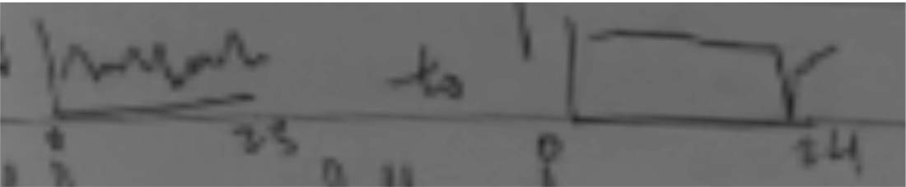

# Hello! 

As a Leo, I must make every occasion as much about me as possible, and historically I’ve truly gone all out for birthdays. However, this year has been quite unlike most. There was a version of me at the start of the year and a different person standing here now. The transformation happened forcibly without much direction from me, and I cannot say that it is for the better. But in many ways, it was freeing. I have a newfound apathy towards issues that used to consume me, traded for a much deeper investment in other matters. For one, I find myself reflecting much more on my support system and the way you all emotionally or very literally hold me up when I need it the most. This year, as you may know, I’ve experienced emotional lows that made my other 23 years of living seem monotonous. 

Visual: 

I am extremely blessed to have been able to have 23 years of “monotonous” happiness before this, but this first experience was devastating all the same. And apparently life is full of experiences like this: discovering new lows that eclipse the rest. A frightening thought I had not previously understood and a prospect I truly did not want to face earlier this year. But day by day, hug by hug, conversation by conversation, I slowly accepted this fate, believing more and more in my resilience. Together, we have rebuilt me into a form resembling a functional person! I’m able to recognize that coming back from a record low means the incredible people I’m surrounded by have helped me achieve a record increase in happiness. And all while the world falls apart? I’m beyond impressed.

So, this year I’m celebrating how lucky I’ve been to have friends like you. Thank you for being by my side during this time and for being intentional about being a comforting presence. Slowly, I’m beginning to understand that life is also about discovering new highs that shine on and brighten the future, giving you hope in the dark days to come. You are showing me colors I didn’t know existed with which to paint my future with, and I am so grateful to have each and every one of you in my life. Regardless of what the future holds or how our paths diverge and cross again, I will cherish the moments we have as the people we are today, and I am wishing for your happiness always. I love you!
